## 1. Risks – `CreateRiskRequest` & `UpdateRiskStatusRequest`

### 1.1 High risk (Environment)

**Endpoint:** `POST /api/risks`
**Body:**

```json
{
  "title": "Chemical spill during tank cleaning",
  "process": "Tank cleaning",
  "domain": "environment",
  "description": "Solvent spill may reach storm drain during tank cleaning operations.",
  "likelihood": 4,
  "impact": 5,
  "owner": "EHS Manager"
}
```

**Expected logic:**

- `score = 4 * 5 = 20`

- `level = "High"`

- `status = "Open"`

- `domain` in response = `"Environment"`

  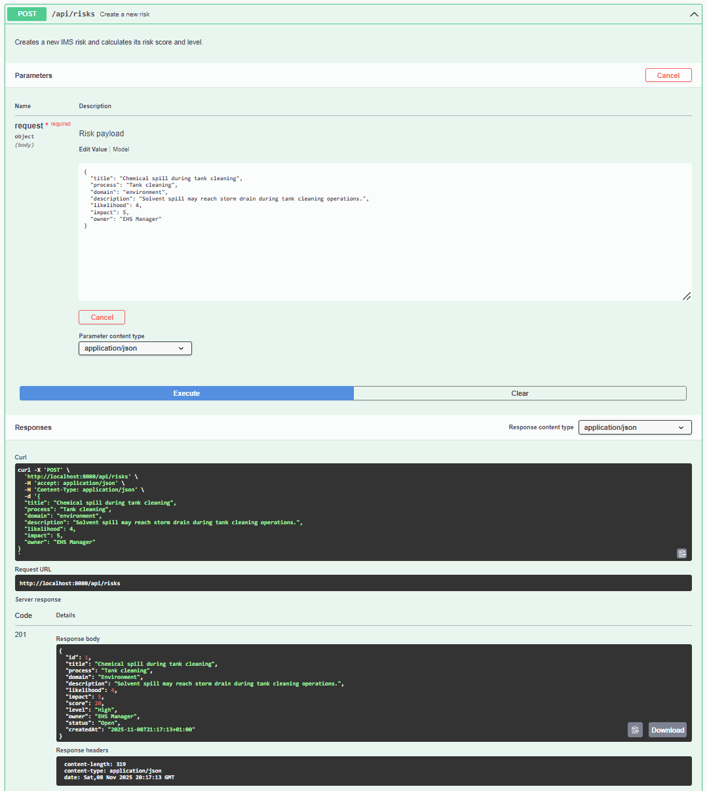

---

### 1.2 Medium risk (Quality)

```json
{
  "title": "Late delivery to key customer",
  "process": "Order fulfilment",
  "domain": "quality",
  "description": "Delays in shipping may cause late deliveries and customer complaints.",
  "likelihood": 3,
  "impact": 4,
  "owner": "Supply Chain Manager"
}
```

Expect:

- `score = 12`

- `level = "Medium"`

- `domain` = `"Quality"`

  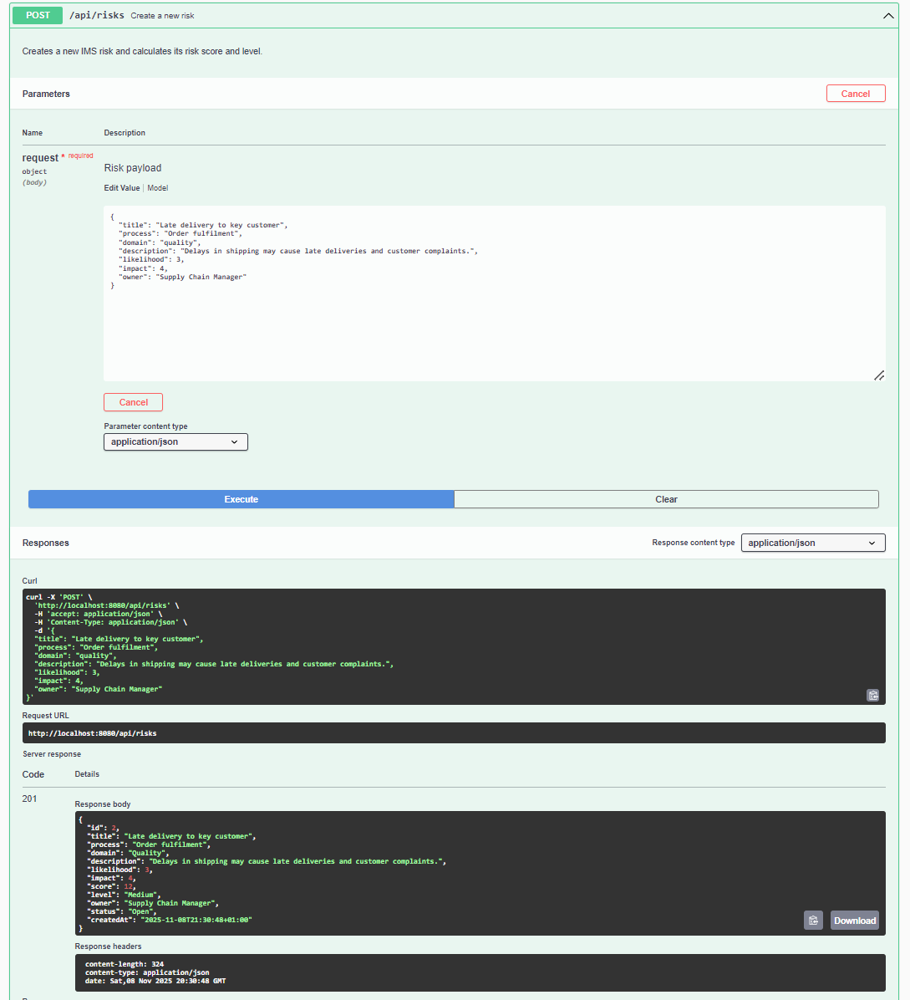

---

### 1.3 Low risk (ISMS)

```json
{
  "title": "Shared workstation without privacy filter",
  "process": "Front office",
  "domain": "isms",
  "description": "Visitors may see sensitive data on screen at front desk.",
  "likelihood": 2,
  "impact": 2,
  "owner": "IT Manager"
}
```

Expect:

- `score = 4`

- `level = "Low"`

- `domain` = `"Information Security"`

  

---

### 1.4 Update risk status – `UpdateRiskStatusRequest`

**Endpoint:** `PUT /api/risks/{id}`

Assume the **Environment risk** got ID `1`, **Quality risk** got ID `2`.

#### Accept a risk

`PUT /api/risks/3` (the low ISMS risk):

```json
{
  "status": "Accepted"
}
```

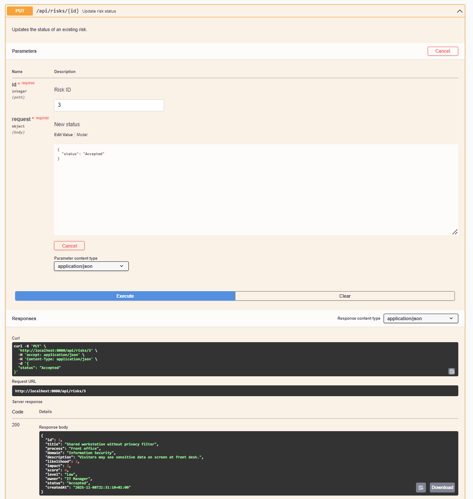

#### Mark a risk as mitigated

`PUT /api/risks/1`:

```json
{
  "status": "Mitigated"
}
```

Expect in response that `status` field changed accordingly.

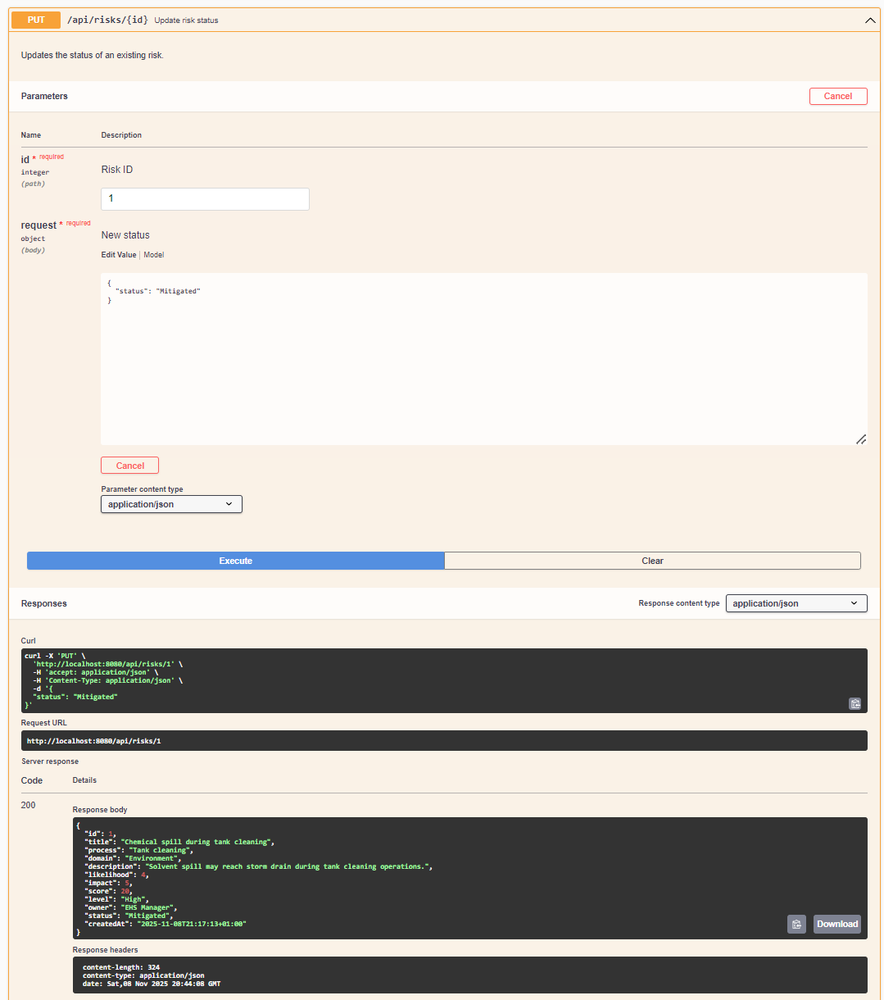

---

## 2. Incidents – `CreateIncidentRequest` & `UpdateIncidentRequest`

### 2.1 OHS incident linked to risk

Assume **Environment risk** (spill) is `id = 1`.

**Endpoint:** `POST /api/incidents`
**Body:**

```json
{
  "title": "Minor solvent spill during tank cleaning",
  "description": "Operator spilled ~2 litres of solvent near drain, contained with absorbent.",
  "domain": "environment",
  "relatedRiskId": 1,
  "severity": 3,
  "likelihood": 3
}
```

**Expected logic:**

- `riskScore = 3 * 3 = 9`

- `riskLevel = "Medium"`

- `status = "Open"`

- `domain` in response = `"Environment"`

  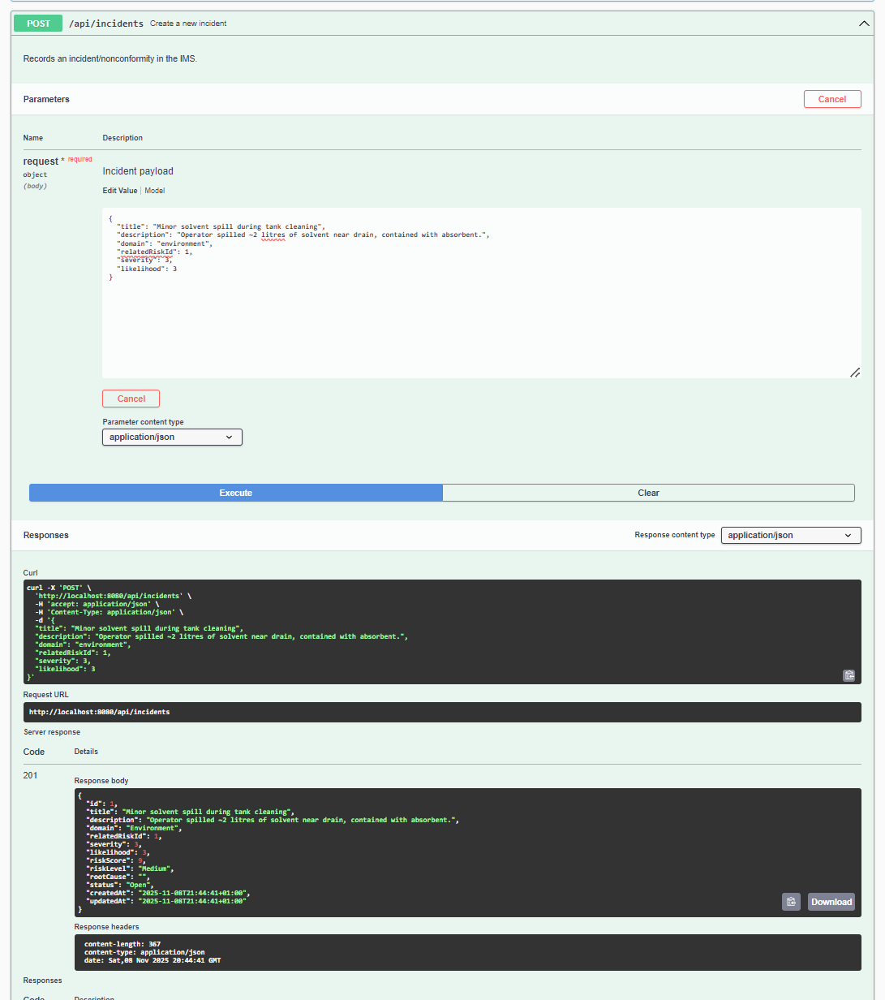

---

### 2.2 Quality incident without related risk

```json
{
  "title": "Customer complaint for late delivery",
  "description": "Key customer reported delivery 2 days late against agreed lead time.",
  "domain": "quality",
  "severity": 3,
  "likelihood": 2
}
```

Expect:

- `riskScore = 6`

- `riskLevel = "Low"`

- `status = "Open"`

- `relatedRiskId` = null / missing.

  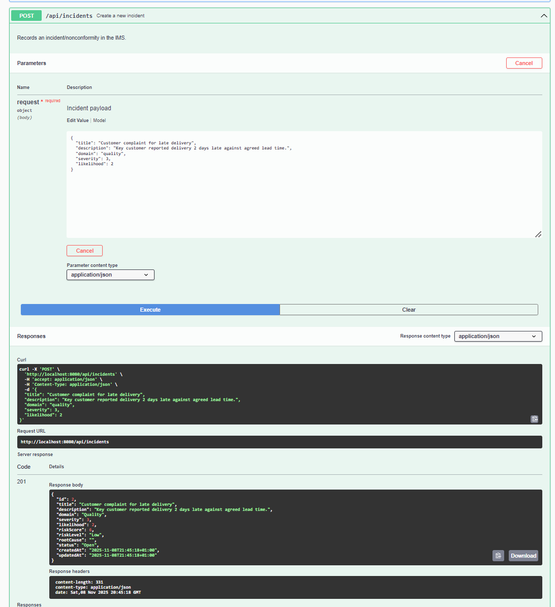

---

### 2.3 Update incident – add root cause & change status

Assume the **customer complaint incident** got ID `2`.

**Endpoint:** `PUT /api/incidents/2`
**Body:**

```json
{
  "rootCause": "No capacity planning; rush orders accepted without checking production load.",
  "status": "Investigation"
}
```

Later, close it:

```json
{
  "status": "Closed"
}
```

Expect:

- `rootCause` stored.

- `status` updated.

- `updatedAt` changed.

  

---

## 3. Audits – `CreateAuditRequest` & `UpdateAuditRequest`

### 3.1 Integrated QMS–EMS audit

**Endpoint:** `POST /api/audits`
**Body:**

```json
{
  "title": "Integrated QMS-EMS internal audit 2025",
  "scope": "Order-to-delivery and waste management processes",
  "domain": "quality",
  "plannedDate": "2025-12-10",
  "auditor": "Lead Auditor"
}
```

Expect:

- `status = "Planned"`

- `domain` in response = `"Quality"`

  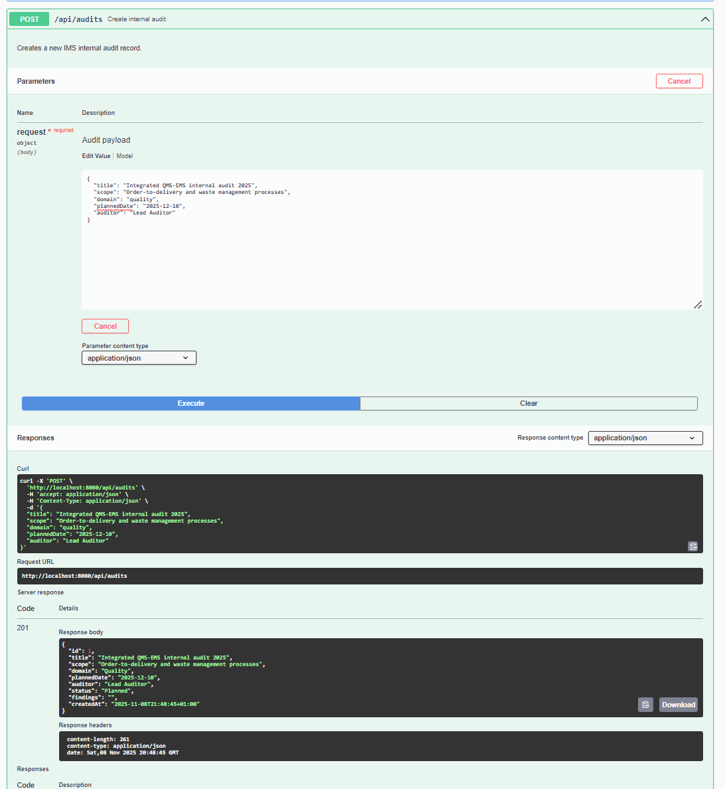

---

### 3.2 OHSMS audit

```json
{
  "title": "OHSMS internal audit on warehouse operations",
  "scope": "Warehouse, loading dock, and forklift operations",
  "domain": "ohs",
  "plannedDate": "2025-11-20",
  "auditor": "HSE Auditor"
}
```

Expect `domain` = `"OHS"`, `status = "Planned"`.


---

### 3.3 Update audit – add findings and close

Assume the **warehouse OHS audit** got ID `2`.

**Endpoint:** `PUT /api/audits/2`
**Body:**

```json
{
  "status": "Completed",
  "findings": "1 minor NC on PPE usage; 2 OFIs related to signage and housekeeping."
}
```

Expect:

- `status` updated to `"Completed"`.

- `findings` saved.

  

---

## 4. Actions (CAPA) – `CreateActionRequest` & `UpdateActionRequest`

We’ll create actions linked to a **Risk**, an **Incident**, and an **Audit**.

### 4.1 CAPA from incident (slip / spill)

Assume environment incident (spill) is `id = 1`.

**Endpoint:** `POST /api/actions`
**Body:**

```json
{
  "title": "Install spill kits near tank area",
  "description": "Place spill response kits and train operators on use.",
  "sourceType": "incident",
  "sourceId": 1,
  "owner": "EHS Manager",
  "dueDate": "2025-11-30"
}
```

Expected logic:

- Service normalizes `sourceType` to `"Incident"` internally.

- Verifies incident with ID 1 exists.

- Sets `status = "Open"`.

  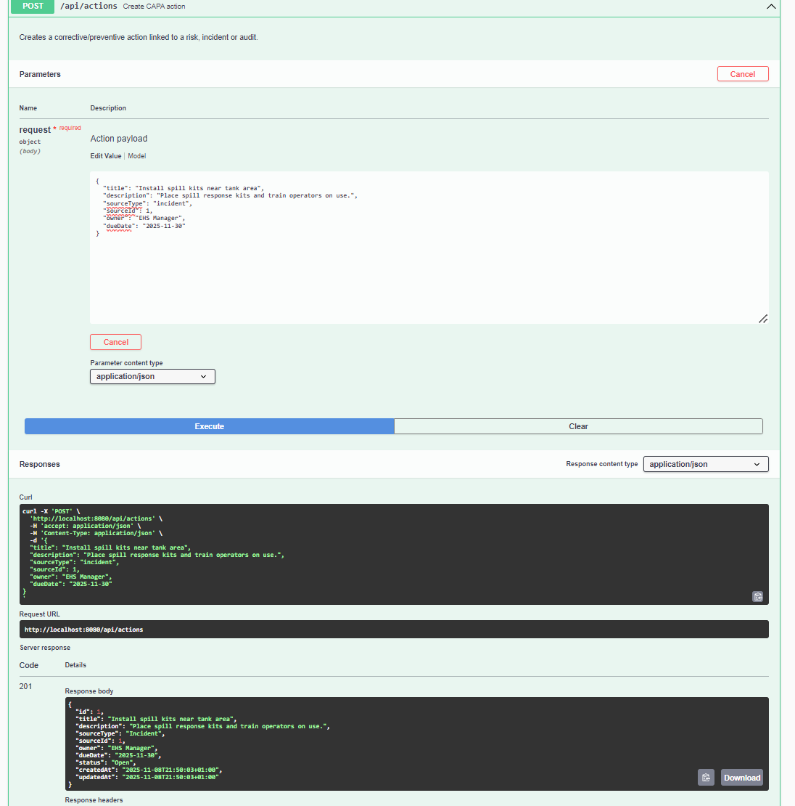

---

### 4.2 CAPA from risk (late delivery risk, id = 2)

```json
{
  "title": "Implement capacity planning tool",
  "description": "Introduce simple capacity planning to avoid overbooking production.",
  "sourceType": "risk",
  "sourceId": 2,
  "owner": "Operations Manager",
  "dueDate": "2026-01-15"
}
```


---

### 4.3 CAPA from audit finding (OHS audit, id = 2)

```json
{
  "title": "Improve PPE usage monitoring",
  "description": "Introduce weekly PPE checks and toolbox talks based on audit findings.",
  "sourceType": "audit",
  "sourceId": 2,
  "owner": "Warehouse Supervisor",
  "dueDate": "2025-12-05"
}
```

All three should be created with:

- `status = "Open"`

- `createdAt` and `updatedAt` set.

  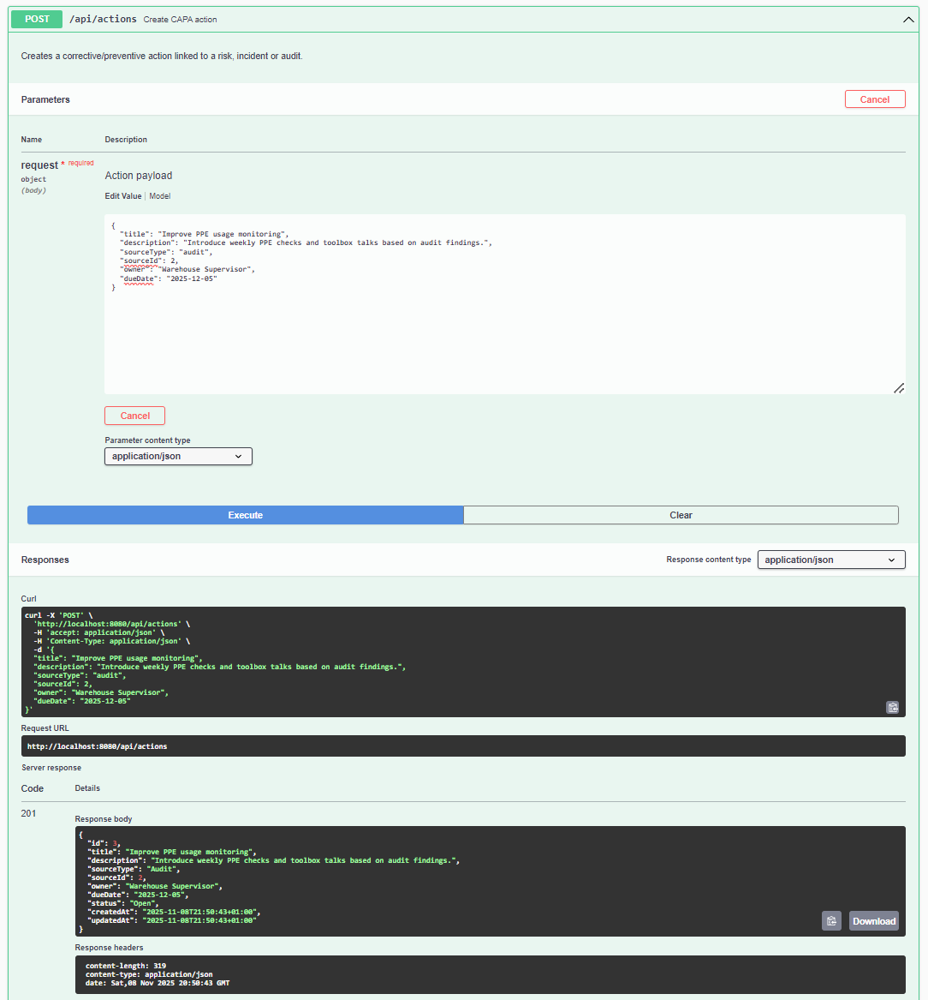

---

### 4.4 Update actions – `UpdateActionRequest`

Assume action IDs:

- Spill kit action → ID `1`

- Capacity planning action → ID `2`

- PPE action → ID `3`

#### Mark spill kit action In Progress

`PUT /api/actions/1`:

```json
{
  "status": "In Progress"
}
```


#### Mark capacity planning action Done & adjust date

`PUT /api/actions/2`:

```json
{
  "status": "Done",
  "dueDate": "2026-01-10"
}
```

#### 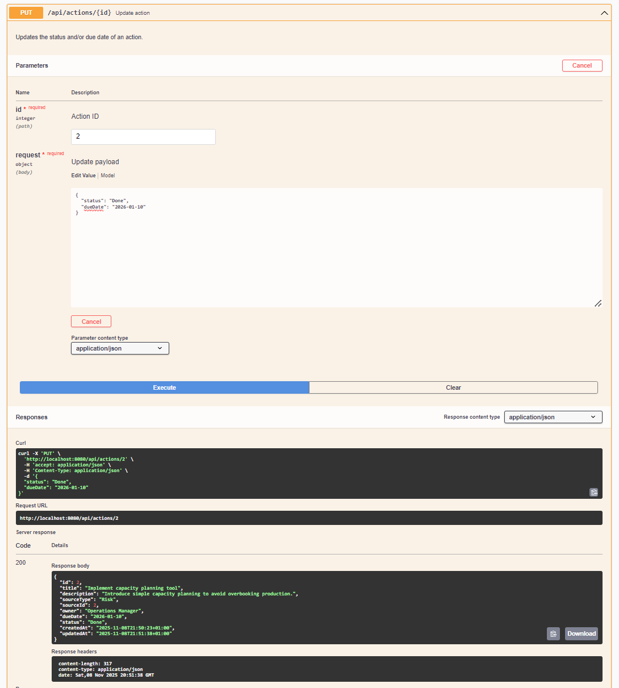

#### Mark PPE action Overdue

`PUT /api/actions/3`:

```json
{
  "status": "Overdue"
}
```


---

## 5. Dashboard – `GET /api/dashboard`

No body here, but **after** all the above, call:

- `GET /api/dashboard`

You should see something like (approximate, numbers depend on exactly how many you created):

```json
{
  "totalRisks": 3,
  "highRisks": 1,
  "totalIncidents": 2,
  "openIncidents": 1,
  "actionsByStatus": {
    "Open": 1,
    "In Progress": 1,
    "Done": 1,
    "Overdue": 0
  },
  "incidentsByDomain": {
    "Environment": 1,
    "Quality": 1
  }
}
```

That confirms:

- Risk scoring & levels worked.

- Domain parsing worked.

- Incident risk scoring worked.

- Actions are grouped by `status`.

- Incidents grouped by `Domain`.

  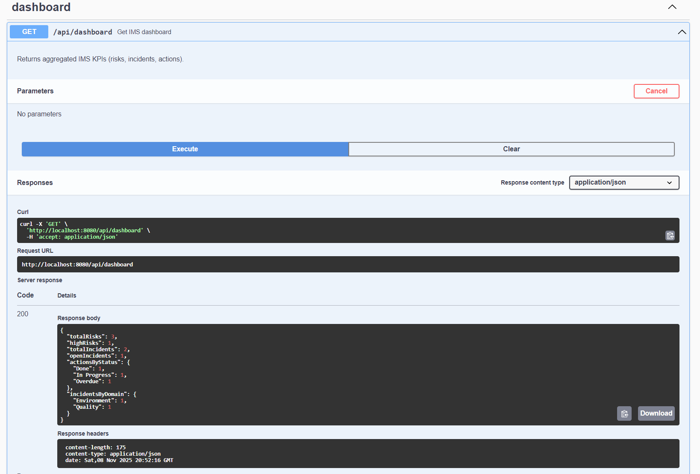
